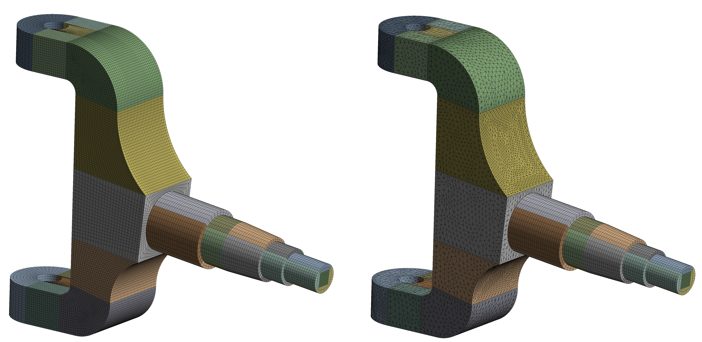

# baja-sae-chassis-structural-analysis-designFinite Element Analysis (FEA) and Structural Validation of a Baja SAE Chassis

This repository contains the technical development and structural validation for my **Final Graduation Project (TCC)** in Mechanical Engineering at UFSCar. The project focuses on advanced simulation techniques to ensure the reliability and safety of an off-road vehicle.

## 🛠 Project Overview

The objective was to perform a complete structural audit and optimization of a Baja SAE roll cage. By integrating field-acquired data with advanced simulation software, I was able to predict fatigue life and validate the chassis under extreme operational conditions.

### Key Technical Contributions:
* **Real-World Load Acquisition:** Utilized proprietary telemetry software from the UFSCar Baja Team to capture dynamic loads during field tests, ensuring that the boundary conditions for the FEA were based on actual physical data.
* **Structural Optimization:** Conducted iterative simulations to balance the trade-off between weight reduction and structural stiffness.
* **Full System Validation:** Analyzed the interaction between the chassis, suspension mounting points, and steering components.

## 📊 Engineering Methodology

### 1. Meshing Strategy & Numerical Accuracy
A critical part of this study was the meshing strategy. I implemented a hybrid approach to maximize results accuracy while maintaining computational efficiency.

  
  
   <em>Figure 1: Comparison between high-quality Hexahedral mesh for structural tubes and Tetrahedral mesh for complex nodes.</em>

* **Hexahedral Meshing:** Applied to regular geometries to provide superior stress gradient resolution.
* **Convergence Study:** Performed to ensure that the results were independent of the element size, a crucial step for academic and professional validation.

### 2. Fatigue Life & Durability Analysis
Using **Ansys** and **SolidWorks**, I focused on the fatigue life of critical components like the wheel hub and steering knuckle.

  
  
   <em>Figure 2: Fatigue life prediction for the wheel hub and steering knuckle after thickness and topology optimization.</em>

### 3. Global Chassis Mesh
The entire assembly was modeled to understand the global behavior of the frame under torsional and impact loads.

  
   <em>Figure 3: Global mesh of the Baja SAE vehicle frame.</em>

## 💻 Tech Stack
* **CAE/FEA:** Ansys Mechanical, SolidWorks Simulation.
* **CAD:** SolidWorks.
* **Data Acquisition:** Custom proprietary software (UFSCar Baja Team).

---
*Note: This project was developed as my Final Graduation Thesis at the Federal University of São Carlos (UFSCar).*
